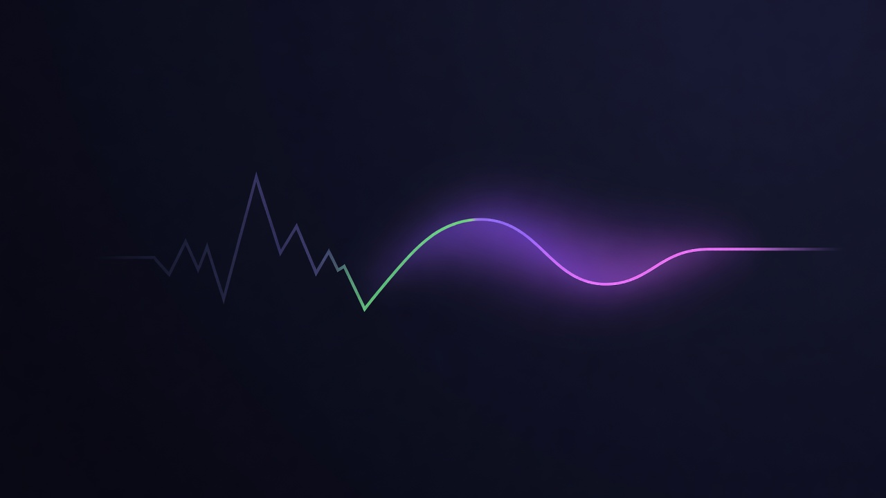

# EvenFlow

> A directional-toxicity-shield hook that smooths LP yield.

> It captures the toxicity premium when flow turns adverse and drips it back to LPs when the market goes quiet — autonomously, across chains, via Reactive Network. Built on an oracle-free directional fee.

[](https://docs.uniswap.org/contracts/v4/overview)
[](https://reactive.network)
[](https://getfoundry.sh/)
[](https://soliditylang.org/)
[](#verify)
[](LICENSE)



📊 [View Pitch Deck](https://canva.link/ohh3e99jzlp1p3i)

> **Status:** unaudited MVP. Benchmarks are reproducible same-flow model comparisons plus live-infrastructure fork tests against the canonical v4 `PoolManager`. They measure mechanics and behavioral differences between fee designs, not realized LP PnL.

---

## What it does

Passive LPs lose to informed, one-directional flow, and even a good defensive fee leaves their realized yield **uneven** — high during toxic bursts, low when it's quiet — with surplus value that stays locked in the pool.

This hook turns that surplus into a smoother payout:

1. **Directional fee (foundation)** — an oracle-free, bounded fee that prices toxicity by direction and *funds* the smoothing reserve.
2. **Yield smoothing (opt-in)** — captures the directional-toxicity premium while flow is adverse, then drips it back to in-range LPs once the market calms. Realized yield gets flatter without giving up total yield.
3. **Reactive autonomous drip (optional)** — a [Reactive Network](https://reactive.network) cron releases the quiet-regime drip cross-chain with no keeper or bot, so stranded reserve reaches LPs **even when zero swaps happen**.

The directional fee is the base the other two layers stand on. Smoothing and reactive are where the value lands for LPs.

## Architecture: three layers

A pool runs any prefix of this stack. Each layer builds on the one below, and the upper two are off until you opt in.

```
┌─ Layer 1 · Directional fee (foundation) ────────────────────────────┐
│   Signed pressure → adaptive LP fee. No custody, no oracle.          │
│   Funds the smoothing reserve. Always on.                            │
└──────────────────────────────────────────────────────────────────────┘
        │  opt in per pool: configureSmoothing(enabled: true)
        ▼
╔═ Layer 2 · Yield smoothing (the point) ═════════════════════════════╗
║   Capture the toxicity premium in toxic regimes → drip it back to    ║
║   in-range LPs in quiet regimes. Flattens realized LP yield.         ║
╚══════════════════════════════════════════════════════════════════════╝
        │  optional autonomous trigger
        ▼
╔═ Layer 3 · Reactive drip (the reach) ═══════════════════════════════╗
║   A Reactive Network cron fires the quiet-regime drip cross-chain,   ║
║   so a stranded reserve returns to LPs even with zero swaps.         ║
╚══════════════════════════════════════════════════════════════════════╝
```

| Layer | Role | Custody? | Default | Proven on |
|---|---|:--:|:--:|---|
| **1 · Directional fee** | funds the reserve | none | always on | local + Base mainnet fork + live Base Sepolia |
| **2 · Yield smoothing** | **the value** | opt-in (ERC-6909 claims) | off | Base mainnet fork + live Base Sepolia capture |
| **3 · Reactive drip** | **the reach** | none added | optional | live Base Sepolia ← Reactive Lasna |

---

## Layer 1 — Directional fee (foundation)

The fee layer is the engine underneath: it prices toxicity so there's a premium to smooth in the first place. It tracks a signed, decaying **directional pressure** per pool and moves the LP fee with it — no oracle, every move clamped:

```
  fee
   ^
3500│        ____ sustained toxic flow → escalate (bounded)
   │       /
3000│──── /─────────────── base ───────────\________ decays back when quiet
   │    /
2500│  *  ← counter-flow swap → discount below base (rewards rebalancers)
   └──────────────────────────────────────────────────────▶ swaps over time
```

Push price one way → fee steps up (bounded). Trade the rebalancing direction → fee discounts below base. Market goes quiet → pressure decays, fee returns to base. Pure v4: permissions are `beforeInitialize`, `afterInitialize`, `beforeSwap`, `afterSwap` (plus `afterSwapReturnDelta` only when smoothing is on).

How the fee logic compares to prior-art dynamic-fee hooks on identical swap flow ([test/PriorArtComparison.t.sol](test/PriorArtComparison.t.sol), [test/DirectionalToxicityShieldMainnetComparison.t.sol](test/DirectionalToxicityShieldMainnetComparison.t.sol)):

| Approach | Reacts to direction? | Discounts counter-flow? | Decays when quiet? | Oracle-free? |
|---|:--:|:--:|:--:|:--:|
| Static fee tier (e.g. live Clanker hook) | per-direction, fixed | no | no | yes |
| Volatility / size dynamic fee | no | no | n/a | usually |
| Nezlobin skew (JDS / Regis / InfHook) | yes | partial / no | often no | varies |
| **EvenFlow** | **yes (signed pressure)** | **yes** | **yes** | **yes** |

Counter-flow: EvenFlow discounts to 2500 while JDS/InfHook/VPIN stay flat at 3000. Toxic-then-quiet: EvenFlow decays back to 3000 while JDS spikes to 6000 and InfHook to 4767 because they don't decay. Versus the live Clanker static-fee hook on a Base mainnet fork, EvenFlow escalates → discounts → decays — charging the right rate at each phase rather than the same rate throughout. Fee views: `getFeePolicy`, `getDirectionalState`, `previewFee`. Captured fee journeys: [Base mainnet fork](docs/demos/base-mainnet-fork-fee-timeline.md), [live Base Sepolia `3000 → 3500 → 2500 → 3000`](docs/demos/base-sepolia-live-fee-timeline.md).

---

## Layer 2 — Yield smoothing (opt-in)

This is the core of the project. A pool that opts in (`configureSmoothing(enabled: true)`) turns the directional fee from a pure defense into a **yield-shaping** mechanism:

- **Capture.** While directional pressure marks flow as toxic, the premium above base fee is escrowed as ERC-6909 claims instead of all flowing out immediately.
- **Drip.** Once the pool returns to a quiet regime, the escrow is released back to in-range LPs through the canonical v4 `donate()` path, on a configurable block cadence.
- **Conserve.** Nothing is created or taken: `captured == dripped + remaining` — enforced by a strict conservation test.

The result is a tighter realized-yield distribution at essentially conserved total yield. On the canonical burst-then-quiet scenario the per-step yield variance drops ~61% (coefficient of variation 429 → 168 bps, a 2.5× tighter distribution) — total yield is fully preserved. Smoothing is most effective for bursty toxicity and intentionally near-neutral under sustained one-way trends — the full scoreboard, including the cases where it doesn't help, is in [docs/product/smoothing-proof-evidence.md](docs/product/smoothing-proof-evidence.md).

Custody is real and opt-in: with smoothing **off** (default) the hook holds no funds and returns no delta. With it **on**, the hook holds captured premium as ERC-6909 claims until it drips — a deliberate change to the risk/audit story, gated to the pool configurer.

```solidity
function configureSmoothing(PoolKey calldata key, SmoothingConfig calldata config) external;
// SmoothingConfig { bool enabled; uint32 dripBlockInterval; uint16 dripBps }
function getSmoothingConfig(PoolId poolId) external view returns (SmoothingConfig memory);
function getSmoothingReserve(PoolId poolId) external view returns (SmoothingReserve memory);
```

**Proof.** Capture → escrow → drip on the real Base mainnet `PoolManager` ([docs/demos/base-mainnet-fork-smoothing-capture-drip.md](docs/demos/base-mainnet-fork-smoothing-capture-drip.md)) and live premium capture across 6 broadcast swaps on Base Sepolia that sums to the on-chain reserve to the wei ([docs/demos/base-sepolia-live-smoothing-capture.md](docs/demos/base-sepolia-live-smoothing-capture.md)).

---

## Layer 3 — Reactive autonomous drip (optional)

Smoothing has one gap: the in-pool drip only fires on an *organic* quiet-regime swap. In a long-quiet market the reserve can sit stranded with no transaction to trigger its release. [Reactive Network](https://reactive.network) closes that gap with no keeper, bot, or trusted operator:

```
   Reactive (Lasna)                      Base
 ┌────────────────────┐               ┌────────────────────────┐
 │ ShieldReactive     │  cross-chain  │ callback proxy         │
 │ Controller         │ ───Callback──▶│   └─▶ ShieldReactive   │
 │ (subscribes CRON)  │  per cron tick│       Executor         │
 └────────────────────┘               │         └─▶ Shield     │
                                       │   triggerQuietDrip()   │
                                       │   donate() ──▶ LPs     │
                                       └────────────────────────┘
```

The executor never forces anything: the hook re-validates regime, cooldown, and reserve on every callback, so an ineligible pool is ignored safely. The callback is verified two ways — `msg.sender` must be the chain callback proxy, **and** the proxy-injected `rvm_id` must equal the registered `controllerRvmId` (locked once via `setController`).

**Live testnet proof.** On Base Sepolia ← Reactive Lasna, a cron tick delivered a verified `onQuietDrip` that released the trapped LP reserve through `donate()` with no swap — tx [`0x7a2b6afb…ed71f`](https://sepolia.basescan.org/tx/0x7a2b6afb30e436f9da3b1bc3dde55bc5f549654443b96fc681a029313ebed71f) (block 42275501): `proxy.callback → executor.onQuietDrip → DripCallbackReceived → triggerQuietDrip → donate → DripReleased`.

Contracts: [`ShieldReactiveController`](src/reactive/ShieldReactiveController.sol) / [`ShieldReactiveControllerCronOnly`](src/reactive/ShieldReactiveControllerCronOnly.sol) (Reactive) and [`ShieldReactiveExecutor`](src/reactive/ShieldReactiveExecutor.sol) (Base).

---

## Public API

```solidity
// Opt-in yield smoothing (Layer 2 — configurer-gated)
function configureSmoothing(PoolKey calldata key, SmoothingConfig calldata config) external;
function getSmoothingConfig(PoolId poolId) external view returns (SmoothingConfig memory);
function getSmoothingReserve(PoolId poolId) external view returns (SmoothingReserve memory);

// Foundation fee views
function getFeePolicy(PoolId poolId) external view returns (FeePolicy memory);
function getDirectionalState(PoolId poolId) external view returns (DirectionalState memory);
function previewFee(PoolKey calldata key, SwapParams calldata params) external view returns (uint24);
```

`SmoothingConfig` is `{ bool enabled; uint32 dripBlockInterval; uint16 dripBps }`. Smoothing stays off until `configureSmoothing(enabled: true)`.

Production hook: [src/DirectionalToxicityShield.sol](src/DirectionalToxicityShield.sol).

## Verify

```bash
forge install
forge fmt --check
forge build
forge test          # 157 passing, 4 fork-only skipped
```

The two headline layers, end to end:

```bash
# Layer 2 — smoothing capture → escrow → drip, value conservation as a hard gate
forge test --match-contract DirectionalToxicityShieldSmoothingLiveDemoTest --fork-url "$BASE_MAINNET_RPC_URL" -vv
forge script script/SmoothingProofReport.s.sol:SmoothingProofReport   # IL / LVR / variance scoreboard

# Layer 3 — reactive controller/executor + cross-chain e2e
forge test --match-path 'test/reactive/*.sol'
forge test --match-path 'test/ShieldReactiveForkE2E.t.sol'
```

Foundation fee against real infrastructure (Base mainnet fork — proves EvenFlow and the live Clanker hook share the canonical `PoolManager` `0x498581fF718922c3f8e6A244956aF099B2652b2b`):

```bash
forge test --match-contract DirectionalToxicityShieldMainnetComparisonTest --fork-url "$BASE_MAINNET_RPC_URL" -vv
```

Captured artifacts (each row links an explorer-verifiable tx):

- **Smoothing** capture → drip on the real PoolManager — [docs/demos/base-mainnet-fork-smoothing-capture-drip.md](docs/demos/base-mainnet-fork-smoothing-capture-drip.md)
- **Smoothing** live Base Sepolia premium capture (6 broadcast swaps, sums to on-chain reserve to the wei) — [docs/demos/base-sepolia-live-smoothing-capture.md](docs/demos/base-sepolia-live-smoothing-capture.md)
- **Smoothing** IL / LVR / yield-variance scoreboard — [docs/product/smoothing-proof-evidence.md](docs/product/smoothing-proof-evidence.md)
- Fee journey on the real PoolManager — [docs/demos/base-mainnet-fork-fee-timeline.md](docs/demos/base-mainnet-fork-fee-timeline.md)
- Live Base Sepolia fee path `3000 → 3500 → 2500 → 3000` — [docs/demos/base-sepolia-live-fee-timeline.md](docs/demos/base-sepolia-live-fee-timeline.md)

## Deploy

```bash
# Local dry run (Anvil)
forge script script/00_DeployHook.s.sol:DeployHookScript \
  --rpc-url http://127.0.0.1:8545 --private-key <ANVIL_PRIVATE_KEY> --broadcast

# Live network (use a keystore account, not a raw key)
forge script script/00_DeployHook.s.sol:DeployHookScript \
  --rpc-url <RPC_URL> --account <KEY_NAME> --sender <ADDRESS> --broadcast
```

The script mines a CREATE2 salt for the hook permission bits and deploys against the configured v4 `PoolManager`. Latest testnet runs are recorded under [deployments/](deployments/). Smoothing config, the reactive controller/executor deploy (`cast send --create`, not `forge script`), full testnet stage gates, the simulation/backtest harness, keystore setup, and troubleshooting live in [docs/DEVELOPMENT.md](docs/DEVELOPMENT.md).

## Security posture

- **Static analysis clean (0 High).** Slither + Aderyn scoped to first-party sources, with reproducible configs ([`slither.config.json`](slither.config.json), [`aderyn.toml`](aderyn.toml)). Findings triaged in [`audit/TRIAGE.md`](audit/TRIAGE.md) — all remaining items are known v4-hook idioms (reentrancy inside PoolManager unlock, unused donate return, timestamp comparisons on minute-scale windows). Constructor zero-address guards hardened on the production reactive wiring.
- **No third-party audit yet.** Independent review before mainnet deployment with real capital.
- **Invariant + unit coverage.** 157 tests (23 suites), plus a dedicated invariant suite (256 runs × 64 depth). Conservation gate (`captured == dripped + remaining`) enforced by a strict test.
- **Custody is opt-in and is the main risk surface.** Smoothing off (default) → no return delta, no funds held. Smoothing on → the hook holds captured premium as ERC-6909 claims before `donate()`; conservation enforced by tests. `configureSmoothing` is gated to the pool configurer.
- **Reactive drip adds no custody and can't be forced.** Callbacks are verified two ways (callback proxy `msg.sender` + locked `rvm_id`), and the hook re-validates regime, cooldown, and reserve on every callback — an ineligible pool is ignored safely.
- **No oracle, no admin price input.** Fees derive only from local pool state (tick movement, elapsed time, liquidity) — nothing external to manipulate.
- **Bounded by construction.** Every fee is clamped to `[minFee, maxFee]` with a per-update `maxFeeStep`; pressure is clamped to `maxPressure`. One swap can't move the fee arbitrarily.
- **Settlement is canonical.** Everything goes through the v4 `PoolManager` lock; the hook holds no external balances when smoothing is off.

Report security concerns privately rather than opening a public issue.

## Resources

[Uniswap v4 docs](https://docs.uniswap.org/contracts/v4/overview) · [v4-core](https://github.com/uniswap/v4-core) · [v4-periphery](https://github.com/uniswap/v4-periphery) · [Reactive Network docs](https://dev.reactive.network/)
